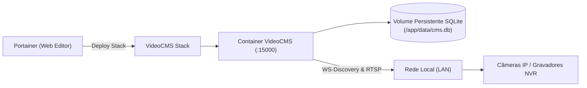

# Guia de Implantação do VideoCMS no Portainer

Este guia fornece instruções completas e passo a passo para implantar, gerenciar, atualizar e realizar backup do **VideoCMS** através da interface web do **Portainer** (Community Edition ou Business Edition).

---

## 1. Arquitetura de Implantação



---

## 2. Pré-Requisitos

1. **Docker Engine** e **Portainer** instalados e operacionais no servidor host.
2. Acesso de rede entre o servidor host e a sub-rede das câmeras IP (portas HTTP `80`/`8080` e RTSP `554`/`8554`).
3. Porta TCP `15000` disponível no host.
4. Chave secreta de criptografia gerada para proteger senhas no SQLite.

### 2.1 Como Gerar a Chave Secreta (`CMS_SECRET_KEY`)
Antes de iniciar o deploy, gere uma chave criptográfica forte de 256 bits executando em qualquer terminal:

```bash
openssl rand -hex 32
```
*Guarde o valor gerado (ex: `e7f8a12b4c5d...`), pois ele será colado como variável de ambiente no Portainer.*

---

## 3. Passo a Passo de Instalação

### Opção 1: Stack Padrão (Modo Bridge - Recomendado para a maioria dos casos)

1. Abra a interface web do seu **Portainer** e selecione o seu ambiente (ex: `local`).
2. No menu lateral esquerdo, clique em **Stacks** e depois no botão **+ Add stack**.
3. No campo **Name**, informe: `videocms` (ou `camera-cms`).
4. Selecione a aba **Web editor**.
5. Copie e cole todo o conteúdo do arquivo [`portainer-stack.yml`](portainer-stack.yml):
   ```yaml
   version: '3.8'

   services:
     cms:
       image: videocms:1.0.0
       container_name: videocms
       restart: unless-stopped
       ports:
         - "15000:15000"
       volumes:
         - cms-data:/app/data
       environment:
         CMS_HOST: "0.0.0.0"
         CMS_PORT: "15000"
         CMS_DB_PATH: "/app/data/cms.db"
         CMS_STATIC_DIR: "/app/web/dist"
         CMS_SECRET_KEY: "${CMS_SECRET_KEY}"
         CMS_ALLOWED_NETWORKS: "${CMS_ALLOWED_NETWORKS:-10.0.0.0/8,172.16.0.0/12,192.168.0.0/16,127.0.0.0/8}"
         CMS_SCAN_ENABLED: "${CMS_SCAN_ENABLED:-true}"
         CMS_SCAN_MAX_CONCURRENCY: "${CMS_SCAN_MAX_CONCURRENCY:-32}"
         CMS_SCAN_TIMEOUT: "${CMS_SCAN_TIMEOUT:-2s}"
         CMS_CAMERA_HEALTH_INTERVAL: "${CMS_CAMERA_HEALTH_INTERVAL:-30s}"
         CMS_LOG_LEVEL: "${CMS_LOG_LEVEL:-info}"
       healthcheck:
         test: ["CMD", "/app/cms", "healthcheck"]
         interval: 30s
         timeout: 5s
         retries: 3
         start_period: 5s

   volumes:
     cms-data:
       driver: local
   ```
6. Role a página até a seção **Environment variables** e clique em **+ Add environment variable**:
   - **Name:** `CMS_SECRET_KEY`
   - **Value:** *(Cole a chave gerada com o openssl)*
7. (Opcional) Adicione outras variáveis se desejar restringir sub-redes ou alterar o nível de log.
8. Clique no botão **Deploy the stack**.
9. Aguarde alguns segundos até que o container seja inicializado e o status mude para **healthy**.
10. Acesse no navegador:
    👉 `http://IP_DO_SEU_SERVIDOR:15000`

---

### Opção 2: Stack em Modo Host Network (Linux Nativo com Descoberta Multicast)

Utilize esta opção quando o servidor estiver rodando **Docker nativo em Linux** e você desejar que o **WS-Discovery automático** localize câmeras via pacotes multicast UDP 3702 sem necessidade de varredura manual por CIDR.

> ⚠️ **Aviso de Segurança:** O modo `network_mode: host` remove o isolamento de portas do Docker. A aplicação VideoCMS continuará validando todas as conexões contra a sua política de SSRF e allowlist de sub-redes.

1. No Portainer, clique em **Stacks** $\rightarrow$ **+ Add stack**.
2. Copie o conteúdo de [`portainer-stack-host-network.yml`](portainer-stack-host-network.yml).
3. Configure a variável `CMS_SECRET_KEY`.
4. Clique em **Deploy the stack**.

---

### Opção 3: Stack utilizando Imagem do GitHub Container Registry (GHCR)

O projeto publica imagens automaticamente no GHCR através do repositório oficial [`facrf/videocmsgemini`](https://github.com/facrf/videocmsgemini). Você pode utilizar o modelo [`portainer-stack-ghcr.example.yml`](portainer-stack-ghcr.example.yml):

- **Imagem no GHCR:**
  Configure a imagem no YAML como `image: ghcr.io/facrf/videocmsgemini:0.1.0` (ou `:latest`).
- **Autenticação (caso privado):**
  1. No Portainer, acesse **Registries** $\rightarrow$ **+ Add registry** $\rightarrow$ **Custom registry**.
  2. URL: `ghcr.io`, Informe seu usuário do GitHub e um Personal Access Token com permissão `read:packages`.
  3. No YAML da stack, informe a imagem `ghcr.io/facrf/videocmsgemini:0.1.0`.

---

## 4. Tabela de Variáveis de Ambiente no Portainer

| Variável | Classificação | Padrão | Descrição |
| :--- | :---: | :--- | :--- |
| `CMS_SECRET_KEY` | **Obrigatória** | *(nenhum)* | Chave AES-256-GCM para criptografia de senhas em repouso. |
| `CMS_ALLOWED_NETWORKS` | Opcional | `10.0.0.0/8,172.16.0.0/12,192.168.0.0/16,127.0.0.0/8` | Allowlist CIDR contra SSRF e DNS Rebinding. |
| `CMS_SCAN_ENABLED` | Opcional | `true` | Habilita ou desabilita o scanner de rede. |
| `CMS_SCAN_MAX_CONCURRENCY`| Opcional | `32` | Número máximo de workers simultâneos de varredura. |
| `CMS_SCAN_TIMEOUT` | Opcional | `2s` | Timeout para testes de socket durante a varredura. |
| `CMS_CAMERA_HEALTH_INTERVAL` | Opcional | `30s` | Frequência de verificação de status online/offline. |
| `CMS_LOG_LEVEL` | Opcional | `info` | Nível de log (`debug`, `info`, `warn`, `error`). |

---

## 5. Persistência: Named Volume vs Bind Mount

### 5.1 Named Volume (Padrão e Recomendado)
```yaml
volumes:
  - cms-data:/app/data
```
- Gerenciado automaticamente pelo Docker.
- Preserva todas as câmeras, mosaicos, tags e grupos ao recriar ou atualizar a Stack.

### 5.2 Bind Mount (Opcional para Storage Dedicado)
Se você preferir armazenar o banco em uma pasta específica do sistema operacional (ex: `/opt/videocms/data`):
```yaml
volumes:
  - /opt/videocms/data:/app/data
```
> ⚠️ **Permissões de Arquivo:** O VideoCMS executa internamente como usuário não-root `cms` (`UID 10001`, `GID 10001`). Caso utilize Bind Mount, configure as permissões no host antes do deploy:
> ```bash
> mkdir -p /opt/videocms/data
> chown -R 10001:10001 /opt/videocms/data
> chmod -R 750 /opt/videocms/data
> ```

---

## 6. Procedimento de Atualização Segura

Para atualizar a versão do VideoCMS pelo Portainer:

1. **Faça um Backup prévio** (veja seção 7).
2. No Portainer, abra a Stack do `videocms` e clique na aba **Editor**.
3. Altere a tag da imagem de versão anterior para a nova versão (ex: `videocms:1.0.0` $\rightarrow$ `videocms:1.1.0`).
   *(Evite utilizar `:latest` em produção para manter a previsibilidade).*
4. Clique em **Update the stack**.
5. As migrações do banco de dados SQLite são transacionais e executadas automaticamente na inicialização.
6. Verifique os logs na aba **Containers $\rightarrow$ Logs** para confirmar a inicialização limpa.

### 6.1 Procedimento de Rollback
Se uma nova versão apresentar problemas:
1. No editor da Stack, reverta a tag da imagem para a versão anterior estável (ex: `videocms:1.0.0`).
2. Clique em **Update the stack**.
3. Se necessário, restaure o arquivo SQLite a partir do backup realizado antes da atualização.

---

## 7. Procedimentos de Backup e Restore no Portainer

### 7.1 Realizar Backup Online Consistente
O VideoCMS disponibiliza um comando nativo de backup seguro que utiliza a API `VACUUM INTO` do SQLite (100% consistente mesmo em modo WAL com o servidor ativo):

```bash
# Executar a partir do console do host ou da aba 'Console' do Portainer:
docker exec videocms /app/cms backup /app/data/backups/cms_backup_$(date +%Y%m%d_%H%M%S).db
```

Os backups gerados ficarão armazenados no volume persistente dentro de `/app/data/backups`.

### 7.2 Restaurar um Backup
1. Pare a Stack no Portainer clicando em **Stop this stack**.
2. Substitua o arquivo `/app/data/cms.db` pelo arquivo `.db` do backup desejado.
3. Remova quaisquer arquivos temporários residuais (`cms.db-wal` e `cms.db-shm`).
4. Clique em **Start this stack**.

---

## 8. Limites de Recursos Recomendados (Resource Limits)

Para instalações de grande porte com múltiplos mosaicos simultâneos (16 a 32 streams), você pode adicionar limites de recursos na Stack:

```yaml
services:
  cms:
    # ... configurações anteriores ...
    deploy:
      resources:
        limits:
          cpus: '2.0'
          memory: 1024M
        reservations:
          cpus: '0.5'
          memory: 256M
```

---

## 9. Resolução de Problemas Comuns no Portainer

- **Status "unhealthy":** Verifique os logs do container. Na grande maioria dos casos, isso indica que o diretório `/app/data` não possui permissão de escrita para o UID `10001` ou que a porta `15000` está ocupada por outro processo no host.
- **Descoberta não localiza câmeras em rede diferente:** Utilize a ferramenta de **Varredura por Sub-rede (CIDR)** informando a faixa da VLAN das câmeras (ex: `192.168.10.0/24`).
