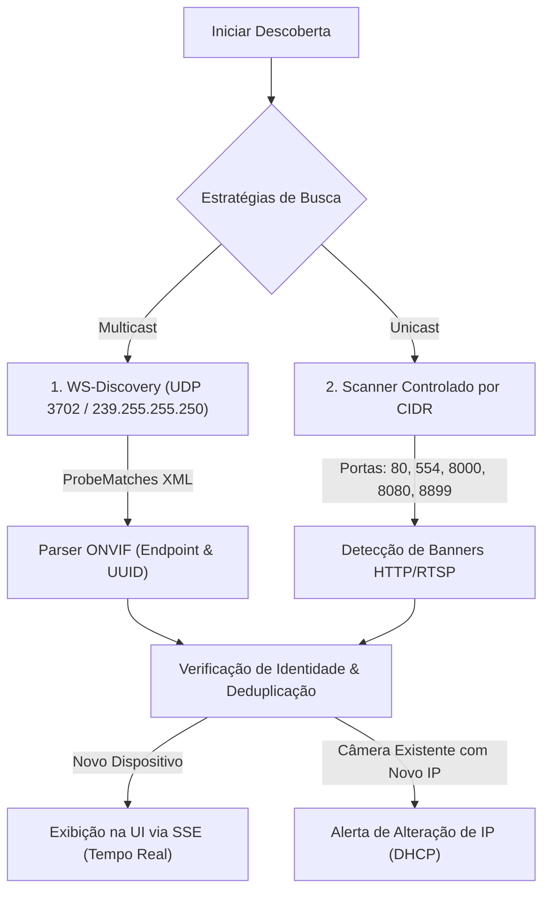

# Descoberta de Dispositivos e Onboarding na Rede Local

Este documento descreve como funciona o motor de descoberta de câmeras IP do **VideoCMS**, detalhando os protocolos **WS-Discovery**, a varredura controlada por **CIDR**, a deduplicação de hardware e o fluxo de autenticação.

---

## 1. Métodos de Descoberta

O VideoCMS combina duas estratégias complementares de localização na rede local:

---

## 2. WS-Discovery (Web Services Dynamic Discovery)

O **WS-Discovery** é o padrão oficial do consórcio ONVIF para descoberta plug-and-play de dispositivos em rede local:

- **Endereço Multicast:** `239.255.255.250`
- **Porta UDP:** `3702`
- **Mensagem Enviada:** SOAP Probe envelope (`http://schemas.xmlsoap.org/ws/2005/04/discovery/Probe`) com filtros para tipos `NetworkVideoTransmitter` (NVT) e `Device`.
- **Processamento de Resposta:** As câmeras ONVIF presentes no mesmo domínio de broadcast respondem com mensagens `ProbeMatches` contendo seus endpoints (`XAddrs`), UUIDs de dispositivo e escopos.

---

## 3. Scanner Controlado por CIDR

Para câmeras legadas sem suporte a WS-Discovery, ou em ambientes com roteamento de VLANs onde pacotes multicast são bloqueados pelo roteador, o VideoCMS implementa um scanner de sub-rede unicast:

1. **Expansão de Sub-rede:** O scanner expande a máscara CIDR informada (ex: `192.168.1.0/24` gera 254 endereços IP utilizáveis).
2. **Pool de Concorrência Controlado:** A varredura utiliza um canal de concorrência com limite configurável (`CMS_SCAN_MAX_CONCURRENCY=32`) para evitar esgotamento de conexões ou saturação do switch.
3. **Sondagem de Portas Candidatas:** Cada IP é sondado simultaneamente nas portas mais comuns de câmeras IP:
   - `80`, `8080`, `8000`, `8899` (HTTP / ONVIF SOAP)
   - `554`, `8554` (RTSP)
   - `443` (HTTPS)
4. **Inspeção de Banners:** Se a porta estiver aberta, o scanner efetua uma requisição leve de verificação de cabeçalhos (`Server`, `WWW-Authenticate`, endpoints `/onvif/device_service`) para identificar fabricante e modelo.

---

## 4. Deduplicação e Tratamento de Alteração de IP (DHCP)

Em redes com atribuição dinâmica de endereços (DHCP), uma câmera previamente cadastrada pode receber um endereço IP diferente após um reboot ou renovação de lease.

O VideoCMS implementa **rastreamento de identidade por hardware**:

- **Critérios de Identidade:** MAC Address, Número de Série do Dispositivo e UUID do endpoint ONVIF.
- **Detecção de Mudança:** Ao descobrir um dispositivo, o sistema verifica se seus identificadores de hardware coincidem com uma câmera já registrada com outro IP.
- **Ação:**
  1. A interface exibe o aviso: `IP alterado de 192.168.1.50 para 192.168.1.120 (DHCP detectado)`.
  2. O operador pode atualizar o cadastro existente com 1 clique (via `POST /api/cameras/:id/update-ip`), preservando tags, grupos, configurações e layouts sem criar duplicatas indesejadas.

---

## 5. Fluxo de Autenticação e Onboarding

Ao localizar um dispositivo na lista de descoberta:

1. **Sondagem com Credenciais (Probe):**
   - O operador informa usuário e senha no modal.
   - O servidor autentica contra a câmera via ONVIF SOAP (`GetDeviceInformation`, `GetCapabilities`, `GetProfiles`) utilizando **WS-Security UsernameToken PasswordDigest**.
   - O VideoCMS valida a compatibilidade e detecta o número de perfis de vídeo disponíveis.
2. **Importação para o Catálogo (1 Clique):**
   - O operador confirma o nome desejado.
   - A câmera é persistida com senha criptografada em repouso (AES-256-GCM) e fica instantaneamente disponível para monitoramento e layouts de mosaico.
