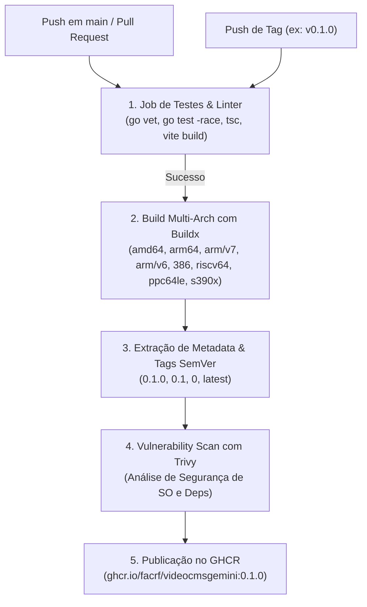

# Guia de Publicação no GitHub Container Registry (GHCR)

Este documento fornece instruções para configurar o repositório remoto no GitHub, acionar a pipeline automatizada de CI/CD e publicar imagens de container no **GitHub Container Registry (`ghcr.io`)**.

---

## 1. Repositório Oficial

- **Repositório primário (Gitea):** `http://192.168.0.10:3010/facrf/videocmsgemini`
- **GitHub Repository:** [`https://github.com/facrf/videocmsgemini`](https://github.com/facrf/videocmsgemini)
- **Container Registry:** `ghcr.io/facrf/videocmsgemini`
- **Tags Disponíveis:**
  - `ghcr.io/facrf/videocmsgemini:0.1.1` (Release SemVer fixa)
  - `ghcr.io/facrf/videocmsgemini:latest` (Última release estável)
  - `ghcr.io/facrf/videocmsgemini:main` (Build contínuo da branch principal)

---

## 2. Como Funciona a Pipeline do GitHub Actions

O arquivo [`.github/workflows/docker-publish.yml`](../.github/workflows/docker-publish.yml) já está configurado na raiz do repositório:



### Arquiteturas Suportadas (Multi-Arch):
- **`linux/amd64`:** Servidores x86_64, desktops e ambientes cloud.
- **`linux/arm64`:** ARM 64-bit (Raspberry Pi 4/5 64-bit, Apple Silicon, AWS Graviton, Rockchip, Jetson).
- **`linux/arm/v7`:** ARM 32-bit v7 (Raspberry Pi 2/3/4 em SO 32-bit, Orange Pi, NVRs embarcados).
- **`linux/arm/v6`:** ARM 32-bit v6 (Raspberry Pi Zero / 1).
- **`linux/386`:** x86 32-bit legados.
- **`linux/riscv64`:** RISC-V 64-bit (SBCs de nova geração).
- **`linux/ppc64le`:** IBM POWER (Little Endian).
- **`linux/s390x`:** IBM System z (Mainframes).

### Regras de Disparo:
- **Pushes na branch `main`:** Validam os testes e geram a imagem com a tag `:main` (não gera `:latest` automaticamente para evitar releases acidentais).
- **Pull Requests:** Validam testes e compilação do Dockerfile sem publicar imagens no registry.
- **Tags de Release (`v*`):** Executam a suíte completa, constroem a imagem multi-plataforma e publicam as tags semânticas e `:latest`.

---

## 3. Publicação pelo Gitea e Push Mirror

O Gitea interno é a origem primária do projeto. Seu push mirror envia branches e tags ao GitHub, onde o evento de push aciona o GitHub Actions e a publicação no GHCR. Não faça alterações diretamente no GitHub, pois o push mirror pode sobrescrevê-las.

Para publicar alterações contínuas na tag `:main`:

```bash
git push origin main
```

Para criar e publicar uma nova release (ex: `0.1.2`):

```bash
# 1. Criar a tag anotada do Git
git tag -a v0.1.2 -m "Release v0.1.2"

# 2. Enviar a tag ao Gitea; o push mirror fará o envio ao GitHub
git push origin v0.1.2
```

O push mirror está configurado para sincronizar a cada novo commit. Se necessário, a sincronização também pode ser acionada em **Configurações → Repositório → Configurações de espelho → Sincronizar agora** no Gitea.

### Onde Acompanhar:
1. **GitHub Actions:** Acesse a aba **Actions** em [`https://github.com/facrf/videocmsgemini/actions`](https://github.com/facrf/videocmsgemini/actions) para acompanhar a execução dos testes e do build multi-plataforma.
2. **GitHub Packages:** Ao término da pipeline, a imagem estará listada na aba **Packages** em [`https://github.com/facrf/videocmsgemini/pkgs/container/videocmsgemini`](https://github.com/facrf/videocmsgemini/pkgs/container/videocmsgemini).

---

## 4. Configurando a Visibilidade do Package

Por padrão, packages publicados no GHCR podem iniciar como **Private**. Para permitir que o Portainer ou outros servidores baixem a imagem:

1. No GitHub, acesse [`https://github.com/facrf/videocmsgemini/pkgs/container/videocmsgemini`](https://github.com/facrf/videocmsgemini/pkgs/container/videocmsgemini).
2. Clique em **Package settings** (no menu lateral direito).
3. Role até a seção **Danger Zone** $\rightarrow$ **Change visibility**.
4. Selecione **Public** (se desejar distribuição livre) ou mantenha **Private** (se for para uso corporativo interno).

---

## 5. Utilizando a Imagem do GHCR no Portainer

### Cenário A: Imagem Pública
No Portainer (ou arquivo `portainer-stack.yml`), basta referenciar a imagem diretamente:

```yaml
services:
  cms:
    image: ghcr.io/facrf/videocmsgemini:0.1.1
    container_name: videocms
    # ... demais configurações ...
```

### Cenário B: Imagem Privada
Se o package for mantido como privado:
1. No Portainer, acesse **Registries** $\rightarrow$ **+ Add registry**.
2. Selecione **Custom registry**:
   - **Name:** `GitHub Container Registry`
   - **Registry URL:** `ghcr.io`
   - **Authentication:** Ative e informe seu usuário do GitHub e um **Personal Access Token (PAT)** com permissão `read:packages`.
3. Na Stack do Portainer, aponte para `ghcr.io/facrf/videocmsgemini:0.1.1`.
