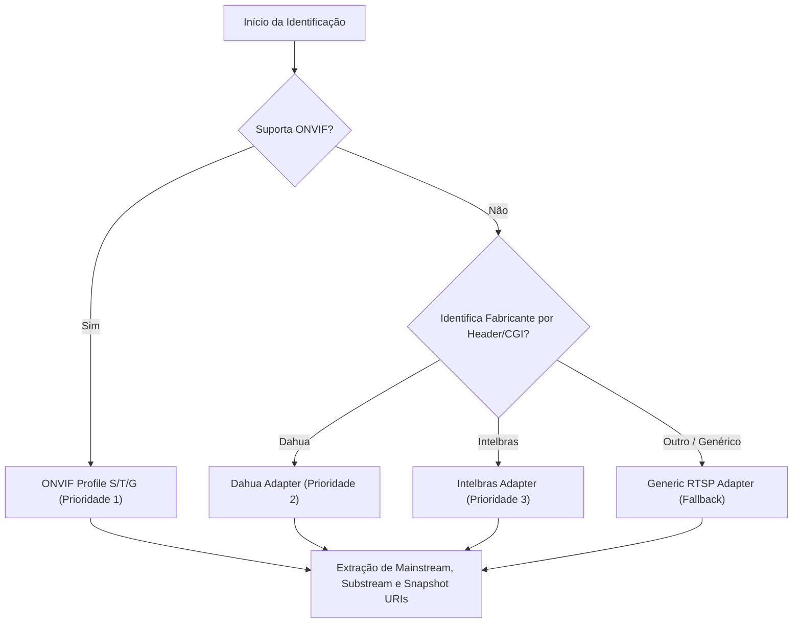

# Matriz de Protocolos e Adaptadores de Fabricantes

Este documento lista todos os protocolos e adaptadores suportados nativamente pelo **VideoCMS**, com seu status de implementação, portas padrões e propósitos no ecossistema.

---

## 1. Tabela Geral de Protocolos

| Protocolo / Adaptador | Portas Típicas | Status | Propósito Principal |
| :--- | :--- | :--- | :--- |
| **WS-Discovery** | UDP 3702 (Multicast `239.255.255.250`) | **Suportado / Nativo** | Descoberta automática de câmeras ONVIF na rede local via sondagem SOAP Probe XML. |
| **ONVIF Core (SOAP)** | TCP 80, 8000, 8080, 8899 | **Suportado / Nativo** | Consulta de metadados do dispositivo (`GetDeviceInformation`), Capabilities, perfis de mídia e URIs de streaming/snapshot com autenticação WS-Security PasswordDigest. |
| **ONVIF PTZ** | TCP 80, 8000, 8080, 8899 | **Suportado / Nativo** | Controle contínuo, relativo e absoluto de Pan/Tilt/Zoom, além de chamada e registro de Presets. |
| **RTSP (TCP / UDP)** | TCP/UDP 554, 8554 | **Suportado / Nativo** | Transporte de vídeo em tempo real (H.264/H.265/MJPEG) para ingestão nos perfis principal (*mainstream*) e secundário (*substream*). |
| **HTTP / MJPEG** | TCP 80, 8080, 15000 | **Suportado / Nativo** | Transmissão de vídeo de baixa latência em formato multipart para visualização nativa em qualquer navegador web sem necessidade de plugins. |
| **Dahua CGI** | TCP 80, 37777 | **Suportado / Nativo** | Endpoints legados e CGI Dahua (`/cgi-bin/configManager.cgi`, `/cam/realmonitor`) para identificação e captura de streams em dispositivos Dahua. |
| **Intelbras CGI** | TCP 80, 37777, 8888 | **Suportado / Nativo** | Endpoints específicos de linha Intelbras com verificação de capacidades prévia antes de qualquer suposição sobre compatibilidade com Dahua. |
| **Generic RTSP** | TCP/UDP 554, 8554 | **Suportado / Nativo** | Adaptador de fallback para encoders, DVRs/NVRs genéricos, câmeras DIY ou servidores RTSP sem ONVIF. |

---

## 2. Ordem de Resolução de Câmeras e Fabricantes

Ao conectar a uma nova câmera ou executar diagnósticos, o VideoCMS aplica a seguinte ordem determinística de detecção:

### Regras Específicas por Fabricante:

1. **ONVIF Nativo:** Se a câmera responder à porta HTTP com serviços ONVIF válidos (`/onvif/device_service`), todos os perfis e URIs são obtidos dinamicamente diretamente do dispositivo via SOAP.
2. **Dahua Technology:**
   - URIs RTSP geradas: `rtsp://<host>:<port>/cam/realmonitor?channel=1&subtype=0` (Main) e `subtype=1` (Sub).
   - Snapshot: `http://<host>:<port>/cgi-bin/snapshot.cgi`.
3. **Intelbras:**
   - O VideoCMS **nunca presume cegamente** que qualquer câmera Intelbras é idêntica a uma Dahua moderna.
   - O sistema valida primeiro as respostas HTTP e banners antes de definir os caminhos RTSP e CGI correspondentes.
4. **Generic RTSP:**
   - Suporta caminhos customizados configurados pelo operador (ex: `/live/ch0`, `/stream1`, `/h264Preview_01_main`).
