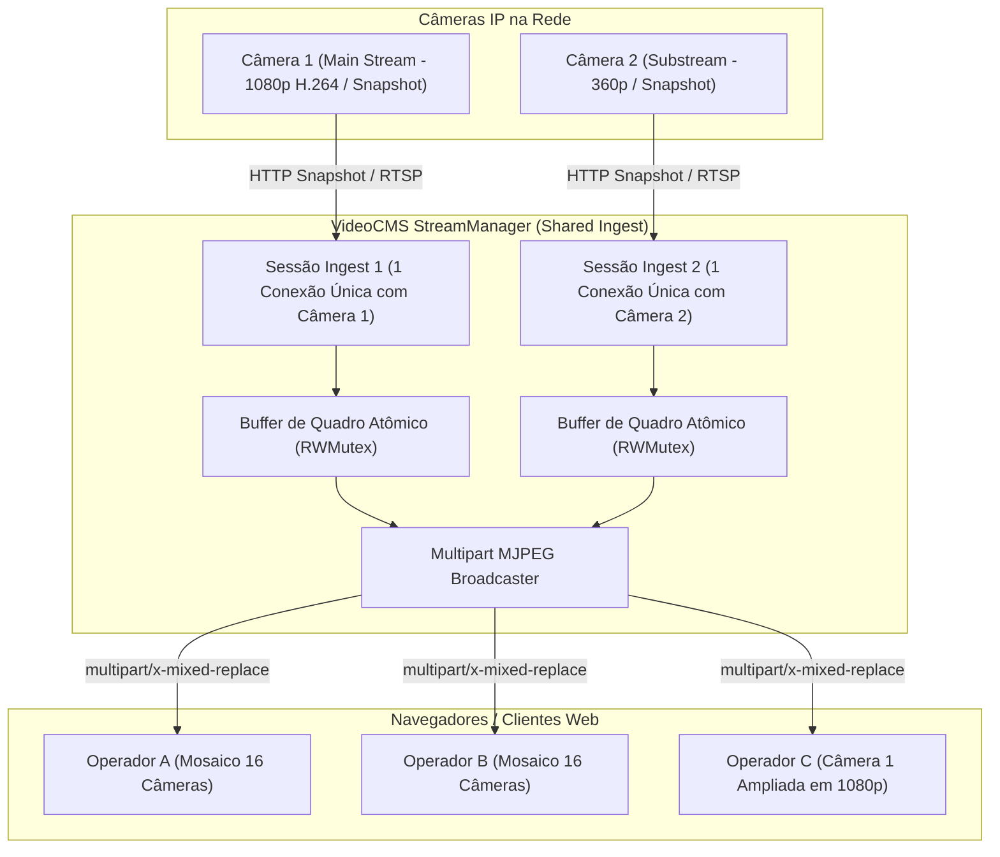

# Arquitetura de Streaming e Mosaico CCTV

Este documento explica como o **VideoCMS** gerencia as transmissões de vídeo ao vivo, a seleção adaptativa de perfis de stream, a compatibilidade com navegadores web e as estratégias de resiliência e reconexão.

---

## 1. O Desafio de Streaming de Câmeras IP no Navegador

Câmeras IP profissionais transmitem vídeo utilizando o protocolo **RTSP (Real-Time Streaming Protocol)** transportando fluxos compactados em **H.264**, **H.265 (HEVC)** ou **MJPEG**.

Navegadores web modernos (Chrome, Firefox, Safari, Edge) **não suportam RTSP diretamente** via tags `<video>` padrão por razões históricas e de transporte de rede (RTSP opera primariamente sobre UDP ou conexões TCP brutas com handshakes SDP/RTP).

---

## 2. Pipeline de Transmissão do VideoCMS (StreamManager)

Para entregar transmissões fluidas e de baixa latência sem sobrecarregar o processamento da máquina host com transcodificação pesada (FFmpeg/GPU), o VideoCMS implementa um pipeline baseado em **Shared Ingest (1:N)** e **Multipart MJPEG / Snapshots Adaptativos**:



### 2.1 Ingestão Compartilhada (Shared Ingest 1:N)
Em sistemas de videomonitoramento, múltiplos operadores frequentemente visualizam a mesma câmera ao mesmo tempo. Conectar $N$ navegadores diretamente à câmera esgota rapidamente a CPU de gravadores ou câmeras de baixo custo.
O **StreamManager** mantém no máximo **1 conexão física** por câmera/perfil e distribui os quadros em memória para todos os clientes conectados.

---

## 3. Seleção Adaptativa de Perfis: Mainstream vs Substream

Para viabilizar grades densas de monitoramento (até **32 câmeras simultâneas** na mesma tela), o VideoCMS aplica streaming adaptativo:

| Perfil | Resolução Típica | Taxa de Bits | Uso no VideoCMS |
| :--- | :--- | :--- | :--- |
| **Substream (Secundário)** | 360p / 480p / 640x360 | 256 kbps - 512 kbps | **Grade de Mosaico (4, 6, 9, 12, 16, 25, 32 câmeras)** |
| **Mainstream (Principal)** | 1080p / 2K / 4K | 2 Mbps - 8 Mbps | **Modo Ampliado / Câmera Única Maximizada** |

### Comutação Automática:
- Ao carregar a tela de mosaico com 4 a 32 posições, todas as células solicitam `/api/cameras/:id/live?profile=sub`.
- Ao clicar no botão de **Ampliar / Maximizar** em qualquer slot, a interface comuta instantaneamente a requisição para `/api/cameras/:id/live?profile=main`, exibindo o vídeo em resolução máxima.

---

## 4. Estratégia de Resiliência e Reconexão com Backoff Exponencial

Quando uma câmera sofre oscilação na rede, perda de energia ou timeout de socket:

```
Status: Conectado (Normal)
      ↓ Falha no stream
Status: Desconectado
      ↓ Tentativa imediata (Retry 1: 200ms)
      ↓ Falha persistente
Status: Backoff Exponencial (500ms → 1s → 2s → 4s → máx 10s)
      ↓ Câmera restabelecida na rede
Status: Reconectado & Stream Normalizado
```

- **Tolerância e Limpeza de Recursos:** Se nenhum operador estiver com a tela aberta (0 visualizadores) por mais de **15 segundos**, a sessão de ingestão é automaticamente encerrada para economizar recursos de rede e memória do servidor.
- **Quadro de Fallback Dinâmico:** Se a câmera estiver offline, o VideoCMS gera um quadro visual elegante com borda de status, identificador e carimbo de data/hora, evitando telas quebradas no navegador.

---

## 5. Limitações Conhecidas e Considerações de Codec

1. **Codecs de Vídeo:**
   - Câmeras configuradas em **H.264** ou **MJPEG** operam de maneira fluida em qualquer navegador.
   - Dispositivos configurados exclusivamente em **H.265 (HEVC)** sem perfil secundário MJPEG/H.264 são sinalizados na interface com a tag `H.265` indicando codec de alta compressão.
2. **Taxa de Quadros no Mosaico:**
   - Em mosaicos densos (16 a 32 câmeras), a taxa de quadros de cada miniatura é mantida em torno de 5 a 7 FPS para garantir consumo moderado de CPU e banda no navegador do operador.
